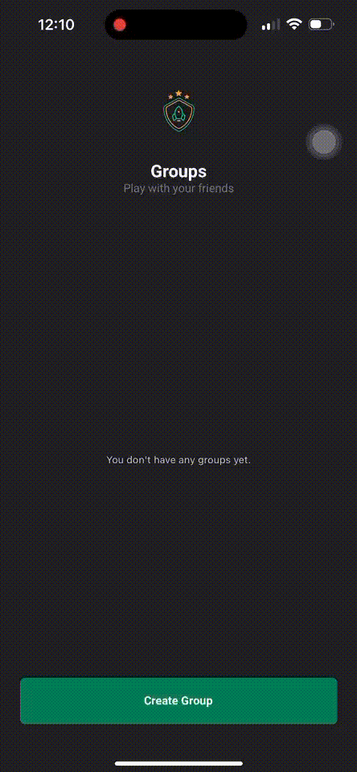
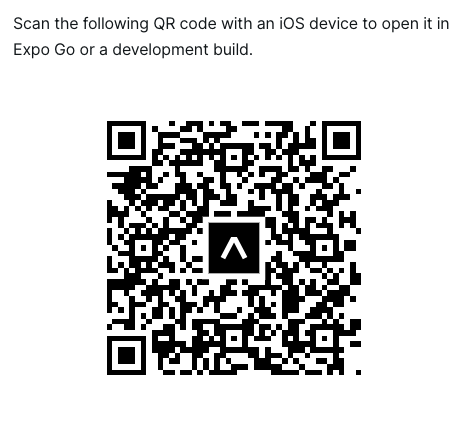

<h1 align="center">
 Team App
</h1>
<br />
<p align="center">
  <a href="#-technologies"> Technologies </a>&nbsp;&nbsp;&nbsp;|&nbsp;&nbsp;&nbsp;
  <a href="#-project"> Project </a>&nbsp;&nbsp;&nbsp;|&nbsp;&nbsp;&nbsp;
  <a href="#-layout">Layout</a>&nbsp;&nbsp;&nbsp;|&nbsp;&nbsp;&nbsp;
  <a href="#-challenge">How to run</a>&nbsp;&nbsp;&nbsp;|&nbsp;&nbsp;&nbsp;
</p>

<div align="center" justify="center">
 
  
  
  <a href="http://www.linkedin.com/in/thayscasado" target="_blank">
  
    </a>
    <a href="https://gofund.me/3265ea9e" target="_blank">
  
  </a>


</div>

<br>

<p align="center">
  

## 💻 Project

Team App is a basic React Native application created for practicing React Native development. This app allows users to manage groups, create new groups, and add players to teams within those groups.

## 🧠 Challenge
This project was developed during the Ignite course, a bootcamp offered by [Rocketseat](https://rocketseat.com.br/). The goal of creating this project was to practice React Native concepts, such as navigation, componentization, state management using Expo Managed Workflow, styled-components, immutability, interactive interfaces, and more.

## 🎨 Features

- **Groups**: View a list of all existing groups and create new groups.
- **New Group**: Create a new group using a form. After creating a group, you will be redirected to the Players page.
- **Players**: Add new players to two different teams (Team A and Team B) within a group. Prevents duplicate player names across teams and displays the number of players.

## 📚 Learning Objectives

Throughout this project, we focused on several key React Native concepts and techniques, including:

- Navigation Stack
- useCallback and useEffect with focus
- Componentization
- Passing data through navigation
- Defining routes
- Customizable theme implementation
- Customizable font families

## 🚀 How to run

To run the Team App on your local machine, follow these steps:

1. Clone this repository:
    
    ```bash
    git clone https://github.com/tatacsd/teamsapp.git
    ```
2. Install dependencies:

    ```bash
    npm install
        # or
    yarn install
    ```
3. Start the development server:

    ```bash
    npx expo start
    ```

This will start the development server and provide instructions for running the app on different platforms (Android, iOS, web).


Alternatively, can downlad expo app on your mobile and scan the QR code to run the app on your device.




add to eas build
## 🛠 Eas Build
To build the app using EAS, follow these steps:
```bash
eas update --branch production --message ""
```


## 🛠 Dependencies
Here are the main dependencies used in this project:
```
@expo-google-fonts/roboto
@react-native-async-storage/async-storage
@react-navigation/native
@react-navigation/native-stack
expo
expo-font
expo-status-bar
expo-updates
phosphor-react-native
react
react-native
react-native-safe-area-context
react-native-screens
react-native-svg
styled-components
Development Dependencies
@babel/core
@types/react
@types/react-native
@types/styled-components
@types/styled-components-react-native
babel-plugin-module-resolver
typescript
```

## License
This project is licensed under the MIT License. 

## Acknowledgments
This app was created as a learning exercise.
Special thanks to [RocketSeat](https://rocketseat.com.br/) for providing the [Ignite](https://rocketseat.com.br/ignite) course and Rodrigo Gonçalves the instructor of this course.
